# Face_recognition_PyZMQ
This is a face recognition project using PyZMQ. I have put three images in the images1 folder for simplicity and I have used the individual images of the main characters of the Harry Potter series, namely Harry, Ron and Hermione. I have put the photo file name as the name of the person in the individual image so that we can easily extract their names from the file name. The face_recognition library uses these three pictures to identify a face in a given image, identify specific features in the face  and generates a face encoding vector of 128 values. Further information can be found [here](https://towardsdatascience.com/face-recognition-25f7421a2268). Using these information, we can recognise people from the images folder in any other group or individual photos available and label/tag them with their names. Below are the three images in our images folder. For those unaware, the first is a picture of Harry Potter, second Hermione Granger and third Ron Weasley.  We will be detecting whether any of these three faces will be present in a photo we upload. If they are found, then they will be labelled with their names.  
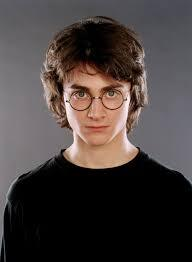 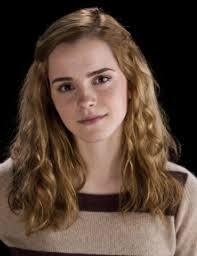 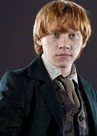
  
The client file takes in an image from the user and the image array is sent to the server file in the form of an array. This image could be a group or individual image. The images need not be converted to grayscale. The server code then processes this image by locating faces, calculating their encodings and then checking whether they match with our encodings. If there are matches, then the minimum Euclidian distance between the located image and the all the initial image encodings is found and the person is labelled using the minimum distance criteria. An image with faces detected and labelled is sent back to the client from the server. So the client receives the labelled image back.    
To run the code, open two Command Prompt windows (Windows + R) and go to the directory where the codes and images are located. Keep the images1 folder as it is and keep the photos on which detection is to be done in the directory. Run server.py on one of the cmd windows and client.py on the other.   Below is how the server.py is run on one cmd window, the client.py is run on another and finally the names are printed on the server window after they are detected. This is the result for the group3.jpg image. 
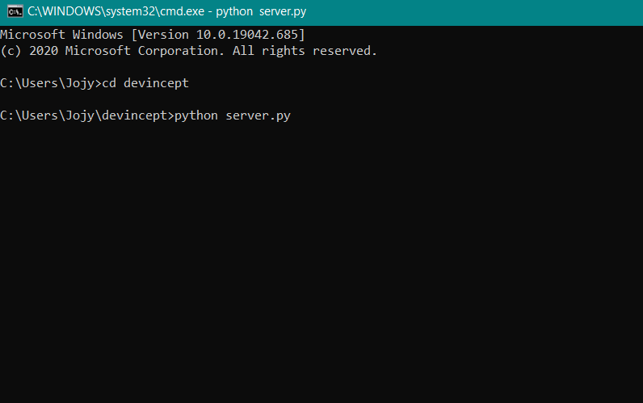 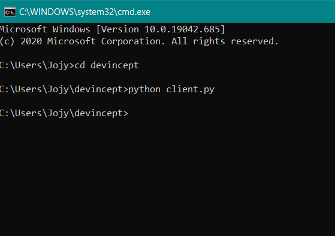 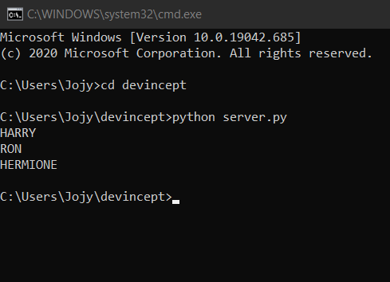   
Moving further, we first try to give a single individual photo of Harry Potter and the results are shown below. So our code is predicting individual persons correctly. 
 <b>Client side input and output for the image harry1.jpg</b> 
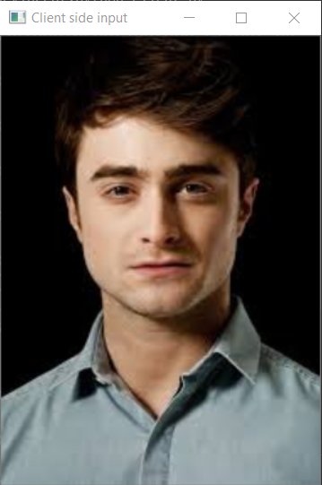 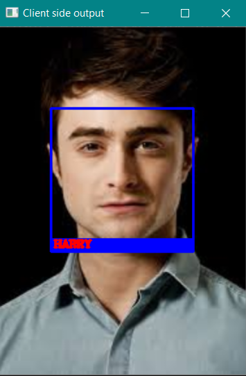   
Now, let try using group photos where a number of people are present and lets find out how many in the photo are present in our image encodings. Here you can see that two people(Hermione and Ron) from the image are from our images folder for which we had encodings from before and they are found from the photo. 
 <b>Client side input and output for the image group2.jpg</b> 
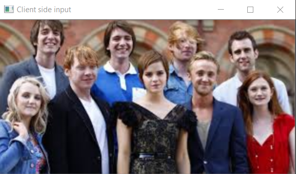 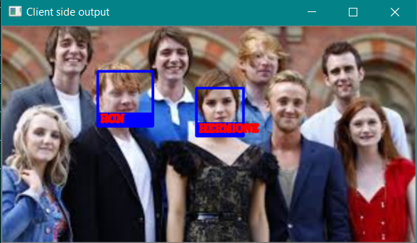   
This is a photo where all three of them a few people in the background. All three faces are detected and labelled correctly. 
 <b>Client side input and output for the image group3.jpg</b> 
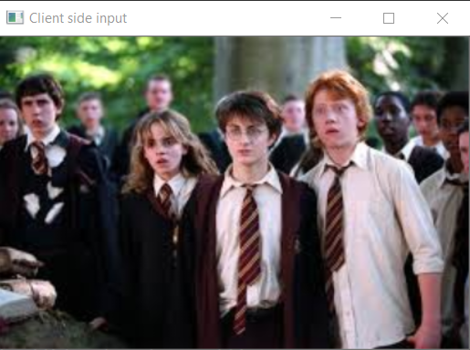 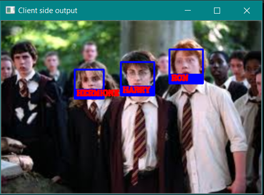   
You can use your own set of images and test them as per your choices using this example.
 Futher reading material: [pyzmq](https://learning-0mq-with-pyzmq.readthedocs.io/en/latest/pyzmq/patterns/client_server.html) ,   [Face recogntion](https://arsfutura.com/magazine/face-recognition-with-facenet-and-mtcnn/)
   
Mariya Jojy
 IIT Patna
 mariyajojy27@gmail.com
